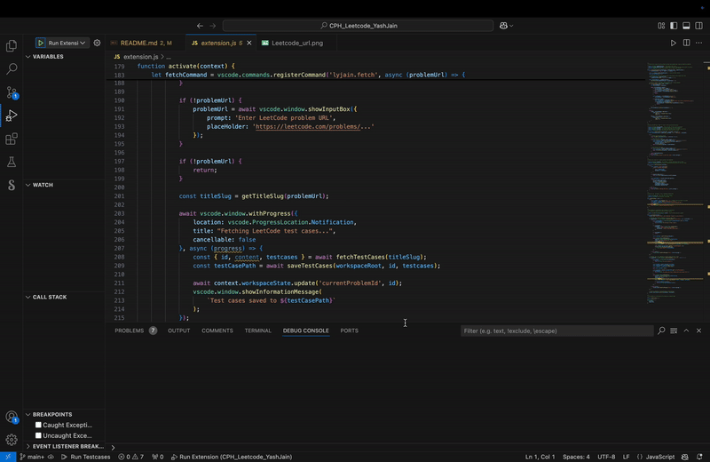
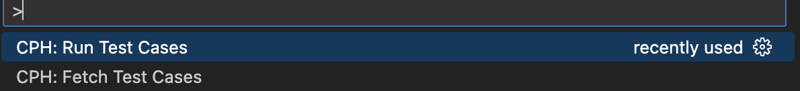
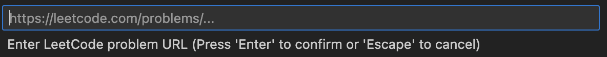

# README
Hey,

This is a VS Code extension which enables you to fetch test cases of any Leetcode problem directly into VS Code, using its url, as txt files.
It also allows you to test run your program in any of the most common languages like C++, Python, Java and JavaScript on these fetched test cases and compare your outputs with the original output.

## How to install?
Clone this repository into your local system.

`git clone https://github.com/YashJainyj2005/CPH-Leetcode-Project.git`

`npm install`

## How to use?

1. Open the Leetcode problem in your browser and copy its url.
2. Run the extension in VS Code.
3. Open the command pallete (Ctrl/Cmd + Shift + P)
4. Search for the command CPH: Fetch Test Cases and select it.
5. Paste the problem url and press enter.
6. The test cases will be locally saved.
7. To run these search for command CPH: Run Test Cases from the command pallete.
8. Results will be shown in the console panel.
9. Done
   

## Features

**1. Problem URL Fetching**

Enable users to fetch test cases directly from LeetCode problem URLs. The system:

- Parses the problem description to extract the test cases (both input and expected output).
- Handles problems with multiple test cases.
- Stores test cases in a structured format for local testing.

**2. Test Case Storage**

Test cases are stored in a format compatible with the CPH extension. For example:

- **Input File**: input_1.txt, input_2.txt, etc.
- **Output File**: output_1.txt, output_2.txt, etc.

**3. Code Execution**

Allows the users to:

- Write their code in their preferred programming language.
- Execute their code against the fetched test cases.
- Compare actual outputs with expected outputs.
- Users to manually edit or add test cases if needed.
- Provides clear error messages when test case fetching fails.

**4. Multi-Language Support**

Provides execution support for commonly used languages, such as:

- C++
- Python
- Java
- JavaScript (using node.js)
## Future Scope of Improvements

The user experience can be further enhanced by its GUI Implementation.

This can be done using VS Code Webview API.

**Enjoy!**
